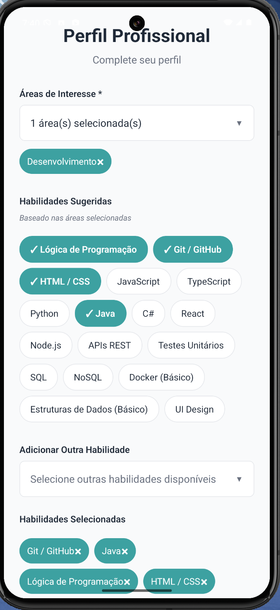

# EqualPath - Aplicativo de Orientação Profissional

## 📱 Sobre o Projeto

EqualPath é um aplicativo mobile desenvolvido em React Native com Expo que ajuda pessoas a descobrirem trilhas de carreira baseadas nas habilidades que elas já possuem e nos seus interesses.

O aplicativo não oferece cursos nem vagas; apenas ajuda o usuário a entender quais trilhas de carreira se alinham melhor com seu perfil atual e quais habilidades precisam ser desenvolvidas.

## 🎯 Funcionalidades

- **Autenticação Completa**: Login e cadastro com persistência local (AsyncStorage)
- **Perfil Personalizado**: Cadastro de habilidades e áreas de interesse
- **Recomendações Inteligentes**: Trilhas recomendadas baseadas no perfil do usuário
- **Exploração de Trilhas**: Visualização de todas as trilhas disponíveis com filtros
- **Detalhes da Trilha**:
  - Descrição completa
  - Habilidades necessárias (destacando possuídas e faltantes)
  - Cursos recomendados com links
  - Opção de seguir trilha
  - Marcação de trilha como concluída
- **Minhas Trilhas**: Visualização de trilhas seguidas com filtros (todas, em progresso, concluídas)
- **Estatísticas**: Contador de trilhas concluídas e em progresso no perfil
- **Edição de Perfil**: Atualização completa de dados pessoais e profissionais

## 🛠️ Tecnologias Utilizadas

- **React Native** - Framework para desenvolvimento mobile
- **Expo** - Plataforma para desenvolvimento React Native
- **React Navigation** - Navegação entre telas (Stack Navigator e Bottom Tabs)
- **AsyncStorage** - Persistência local de dados
- **Expo Vector Icons** - Biblioteca de ícones (MaterialIcons)
- **React Native Safe Area Context** - Gerenciamento de áreas seguras
- **ESLint** - Linter para análise estática de código
- **Prettier** - Formatador de código automático
- **Dados Mockados** - Dados fictícios para demonstração (não requer backend)

## 📁 Estrutura do Projeto

```
equalpath/
├── src/
│   ├── components/        # Componentes reutilizáveis (.jsx)
│   │   ├── Button.jsx
│   │   └── Input.jsx
│   ├── screens/          # Telas do aplicativo (.jsx)
│   │   ├── LoginScreen.jsx
│   │   ├── SignUpScreen.jsx
│   │   ├── SignUpProfileScreen.jsx
│   │   ├── HomeScreen.jsx
│   │   ├── TrilhasScreen.jsx
│   │   ├── TrilhaDetalheScreen.jsx
│   │   ├── MinhasTrilhasScreen.jsx
│   │   └── PerfilScreen.jsx
│   ├── navigation/       # Configuração de navegação (.jsx)
│   │   └── MainNavigator.jsx
│   ├── data/            # Dados mockados (.js)
│   │   ├── areasAndSkills.js
│   │   ├── trilhas.js
│   │   └── userData.js
│   ├── services/        # Serviços e lógica de negócio (.js)
│   │   └── authService.js
│   ├── utils/           # Utilitários (.js)
│   │   └── stringUtils.js
│   └── styles/          # Estilos e tema (.js)
│       └── colors.js
├── assets/              # Imagens e recursos
│   └── logo-cameleon.png
├── App.jsx              # Arquivo principal (componente React)
├── index.jsx            # Ponto de entrada da aplicação
├── .eslintrc.js         # Configuração do ESLint
├── .prettierrc.js       # Configuração do Prettier
└── package.json
```

**Nota sobre extensões:**
- Arquivos `.jsx`: Componentes React que contêm JSX (telas, componentes, navegação)
- Arquivos `.js`: Utilitários, serviços, dados e configurações que não usam JSX

## 🚀 Como Executar

1. **Instalar dependências:**

```bash
npm install
```

2. **Iniciar o aplicativo:**

```bash
npm start
```

3. **Executar no dispositivo:**
   - Escaneie o QR code com o app Expo Go (iOS) ou Expo Go (Android)
   - Ou pressione `i` para iOS simulator ou `a` para Android emulator

**Comandos adicionais:**
- `npm run lint` - Verificar problemas de código com ESLint
- `npm run lint:fix` - Corrigir automaticamente problemas do ESLint
- `npm run format` - Formatar código com Prettier
- `npm run format:check` - Verificar formatação sem alterar arquivos

## 📱 Telas do Aplicativo

### 1. LoginScreen


### 2. RegisterScreen (SignUpScreen)




### 3. HomeScreen (Meu Caminho)


### 4. TrilhasScreen


### 5. TrilhaDetalheScreen


### 6. Minhas Trilhas


### 7. PerfilScreen


## 🎨 Tema e Estilização

O aplicativo utiliza um tema consistente com cores definidas em `src/styles/colors.js`:

- **Primary**: Teal (#3DA1A1)
- **Primary Light**: Light Teal (#80CBC4)
- **Secondary**: Cyan (#00ACC1)
- **Background**: Light Gray (#F9FAFB)
- **Surface**: White (#FFFFFF)
- **Text**: Dark Gray (#1F2937)
- **Text Light**: Gray (#6B7280)
- **Border**: Light Gray (#E5E7EB)
- **Error**: Red (#B00020)

## 📝 Notas Importantes

- **Persistência Local**: O aplicativo utiliza AsyncStorage para salvar dados do usuário localmente
- **Dados Mockados**: Trilhas, áreas e habilidades são dados fictícios armazenados em `src/data/`
- **Sem Backend**: Não há integração com API real
- **Navegação**: Utiliza React Navigation com Bottom Tabs (4 abas) e Stack Navigators aninhados
- **Autenticação**: Sistema completo de login/cadastro com validação e proteção de rotas
- **Trilhas Concluídas**: Sistema de marcação de trilhas como concluídas com estatísticas

## 📚 Requisitos Acadêmicos

Este projeto atende aos requisitos da disciplina de Mobile Application Development:

- ✅ Mínimo de 5 telas (8 telas implementadas)
- ✅ Navegação entre telas (React Navigation)
- ✅ Estilização com cores, fontes e componentes personalizados
- ✅ Arquitetura organizada com separação de componentes, telas, navegação e dados
- ✅ Uso adequado de ferramentas de lint/formatter (ESLint e Prettier)
- ✅ Projeto funcional e pronto para demonstração

## 👥 Integrantes do Grupo

1. Alane Rocha da Silva — RM561052
2. Anna Beatriz de Araujo Bonfim — RM559561
3. Maria Eduarda Araujo Penas — RM560944

## 🎥 Vídeo de Demonstração

https://youtube.com/shorts/373pZBmiqY8?feature=share 

---

Desenvolvido para FIAP - Mobile Application Development
